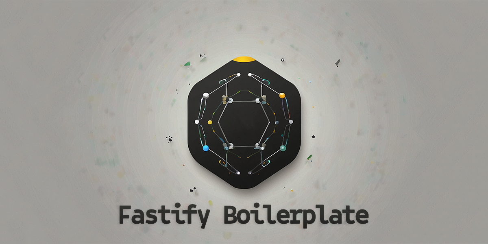
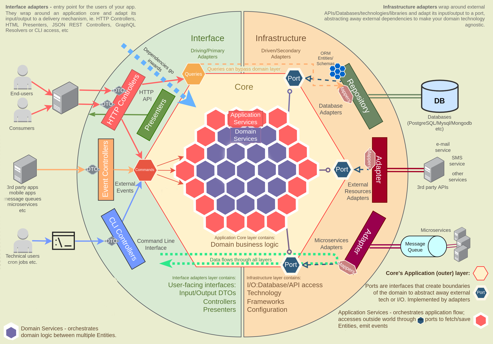

[](https://github.com/prettier/prettier) [](http://commitizen.github.io/cz-cli/) [](https://github.com/alan2207/bulletproof-react/blob/master/LICENCE)  

This meticulously crafted boilerplate serves as a solid foundation for building production-ready Fastify applications. While designed specifically for Fastify, the underlying principles and best practices aim to be adaptable to different frameworks and languages. These principles include clean architecture, domain-driven design, CQRS, vertical slice architecture, and dependency injection.

## ⚡ Features

- Framework: [Fastify 5](https://github.com/fastify/fastify) with [Awilix](https://github.com/jeffijoe/awilix) for the dependency injection and [Pino](https://github.com/pinojs/pino) for logging
- Plugins: [@fastify/helmet](https://github.com/fastify/fastify-helmet) for security headers, [@fastify/swagger](https://github.com/fastify/fastify-swagger) for Swagger documentation, [@fastify/under-pressure](https://github.com/fastify/under-pressure) for automatic handling of "Service Unavailable", [@fastify/awilix](https://github.com/fastify/fastify-awilix) for dependency injection, [typebox](https://github.com/sinclairzx81/typebox) for JSON schema and TS generation and validation
- DB: [Postgres](https://github.com/porsager/postgres) as client + [DBMate](https://github.com/amacneil/dbmate) for seeds and migrations
- Graphql: [Mercurius](https://github.com/mercurius-js/mercurius)
- Format and Style: [Eslint](https://eslint.org/) + [Prettier](https://prettier.io/)
- Dependencies validation: [depcruise](https://github.com/sverweij/dependency-cruiser)
- Release flow: [Husky](https://github.com/typicode/husky) + [Commitlint](https://commitlint.js.org/) + [Semantic-release](https://github.com/semantic-release/semantic-release)
- Tests: E2E tests with [Cucumber](https://cucumber.io/docs/installation/javascript/), and unit and integration tests with [Vitest](https://vitest.dev/)

## 👉 Table of Contents

- [Getting Started](#start)
- [Principles](#principles)
- [Useful resources](#resources)
- [Client types generation](#client-types)

## <a name="start"></a>✨ Getting Started

```bash
npx degit marcoturi/fastify-boilerplate my-app
cd my-app

# To enable yarn 4 follow the instruction here: https://yarnpkg.com/getting-started/install
yarn #Install dependencies.
```

### Common Commands

- `yarn start` - start a development server.
- `yarn build` - build for production. The generated files will be on the `dist` folder.
- `yarn test` - run unit and integration tests.
- `yarn test:coverage` - run unit and integration tests with coverage.
- `yarn test:unit` - run only unit tests.
- `yarn test:coverage` - run only integration tests.
- `yarn test:e2e` - run E2E tests
- `yarn type-check` - check for typescript errors.
- `yarn deps:validate` - check for dependencies problems (i.e. use route code inside a repository).
- `yarn outdated` - update dependencies interactively.
- `yarn format` - format all files with Prettier.
- `yarn lint` - runs ESLint.
- `yarn create:env` - creates and .env file by copying .env.example.
- `yarn db:create-migration` - creates a new db migration.
- `yarn db:migrate` - start db migrations.
- `yarn db:create-seed` - creates a new db seed.
- `yarn db:seed` - start db seeds.

## <a name="principles"></a>🧱 Principles


<sup>Diagram adapted from [here](https://github.com/Sairyss/domain-driven-hexagon)</sup>

### Project Principles

- Adaptable Complexity: The structure should be flexible (scalable through adding or removing layers) to handle varying application complexities.
- Future-Proofing: Technology and design choices should ensure the project's long-term health. This includes: clear separation of framework and application code and utilizing well-established, widely used packages/tools with minimal dependencies.
- Functional Programming Emphasis: Prioritize functional programming patterns and composition over object-oriented approaches (OOP) and inheritance for potentially improved maintainability.
- Microservices-Ready Architecture: Leveraging techniques like vertical slice architecture, path aliases, and CQRS (Command Query Responsibility Segregation) for communication. This promotes modularity and separation of concerns, facilitating potential future extraction and creation of microservices.

### Code Principles

- Framework Agnostic: Using vanilla Node.js, express, fastify? Your core business logic does not care about that either. Therefore, we will minimize fastify dependencies inside modules folder.
- Client Interface Agnostic: The core business logic does not care if you are using a CLI, a REST API, or even gRPC. Command/Query handlers will serve every protocol needs.
- Database Agnostic: Your core business logic does not care if you are using Postgres, MongoDB, or CouchDB for that matter. Database code, problems and errors should be tackled only in repositories.
- The dependencies between software components should always point inward towards the core of the application. In other words, the innermost layers of the system should not depend on the outer layers. The flow of the code will be Route → Handler → Domain (optional) → Repository.

This project is based on some of the following principles/styles:

- [Domain-Driven Design (DDD)](https://en.wikipedia.org/wiki/Domain-driven_design)
- [Hexagonal (Ports and Adapters) Architecture](<https://en.wikipedia.org/wiki/Hexagonal_architecture_(software)>)
- [Clean Architecture](https://blog.cleancoder.com/uncle-bob/2012/08/13/the-clean-architecture.html)
- [Onion Architecture](https://herbertograca.com/2017/09/21/onion-architecture/)
- [SOLID Principles](https://en.wikipedia.org/wiki/SOLID)
- [Vertical slice architecture](https://www.jimmybogard.com/vertical-slice-architecture/))
- [The Common Closure Principle (CCP)](https://en.wikipedia.org/wiki/Common_closure_principle)

### Modules

- Each module's name should reflect an important concept from the Domain and have its own folder (see [vertical slice architecture](https://www.jimmybogard.com/vertical-slice-architecture/)).
- It's easier to work on things that change together if those things are gathered relatively close to each other (see [The Common Closure Principle (CCP)](https://en.wikipedia.org/wiki/Common_closure_principle)).
- Every module is independent (i.e. no direct imports) and has interactions between modules minimal. You want to be able to easily extract a module into a separate microservice if needed.

How do I keep modules clean and decoupled between each one?

- One module shouldn't call other module directly (for example by importing an entity from module A to module B). You should create public interfaces to do so (for example, create a query that returns some data from feature A to anyone who calls it, so module B can query it).
- In case of fire and forget logic (like sending an email after some operation), you can use events to communicate between modules.
- If two modules are too "chatty", maybe they should be merged into a single module

### Module Components

Each layer should handle its own distinct functionality. Ideally, these components should adhere to the [Single Responsibility Principle](https://en.wikipedia.org/wiki/Single-responsibility_principle), meaning they have a single, well-defined purpose:

**Route:**
The process starts with a request (HTTP, GRPC, Graphql) sent to the route. You can find the routes in the `src/modules/feature/{commands|queries}` folder.
Routes handle HTTP request/response, request validation, and response formatting based on the type of protocol implied. They should not contain any business logic.

Example file: [find-users.route.ts](src/modules/user/queries/find-users/find-users.route.ts)

**Command/Query Handler:**
The Command or Query Handler, or an application Service handles the received request. It executes the necessary business logic by leveraging Domain Services. It also interacts with the infrastructure layer through well-defined interfaces (ports). Commands are state-changing operations and Queries are data-retrieval operations. They do not contain domain-specific business logic. One handler per use case it's generally a good practice (e.g., CreateUser, UpdateUser, etc.).

Note: instead of using handler you can also use an application service to handle commands/queries/events.

Using this pattern has several advantages:

- You can implement middlewares in between the route and the handler. This way you can achieve things like authorization, rate limiting, caching, profiling, etc. It's easy to granular apply these middlewares to specific commands/queries by using simple regex i.e. by looking at `users/*` if you want to hit every command in the user module or `users/create` for specific ones. Example file: [middlewares.ts](src/shared/cqrs/middlewares.ts)
- Reduce coupling between modules. Instead of explicitly defining dependencies between modules you can use commands/queries. At the moment you want to extract a module into a separate microservice you can just implement the GRPC request logic in the handler, and you are good to go.

Example file: [find-users.handler.ts](src/modules/user/queries/find-users/find-users.handler.ts)

**Domain Service:**
Contains the core business logic. For example, how to compose a new entity, calculate its own properties and how to change them. In this specific project there are no entities/aggregates classes (see [Domain-Driven Design](https://en.wikipedia.org/wiki/Domain-driven_design)) and data is generally composed by objects/arrays/primitives therefore domain services are the responsible for handling the surrounding business. The domain should represent (in code) what the business is or does (in real life).

Example file: [user.domain.ts](src/modules/user/domain/user.domain.ts)

**Repository:**
Adapts data to its internal format, retrieves or persists data from/to a database as needed. Repositories decouple the infrastructure or technology used to access databases from the other layers (i.e. for example handler/domains should not know if the data is stored in a SQL or NoSQL database). They should not contain business logic.

Example file: [user.repository.ts](src/modules/user/database/user.repository.ts)

General recommendation: The optimal project structure balances complexity with maintainability. Carefully consider the project's anticipated size and intricacy. Utilize as many layers and building blocks as necessary to ensure efficient development, while avoiding unnecessary complexity.

## <a name="folder"></a>🗄️ Folder Structure and Code Organization

The vertical slice architecture is the recommended structure. Each feature encapsulates commands, queries, repositories, etc.

```
.
├── db/
│   ├── migrations
│   └── seeds
├── tests
└── src/
    ├── config
    ├── modules/
    │   └── feature/
    │       ├── commands/
    │       │   └── command-example/
    │       │       ├── command.handler.ts        → Route command handler/service
    │       │       ├── command.route.ts          → Fastify http route
    │       │       ├── command.graphql-schema.ts → Graphql schema
    │       │       ├── command.resolver.ts       → Graphql resolver
    │       │       └── command.schema.ts         → Schemas for request and response validation
    │       ├── database/
    │       │   ├── feature.repository.port.ts    → Fastify repository port
    │       │   └── feature.repository.ts         → Feature repository
    │       ├── domain/
    │       │   ├── feature.domain.ts             → Domain services
    │       │   ├── feature.errors.ts             → Domain-specific errors
    │       │   └── feature.types.ts              → Domain-specific types
    │       ├── dtos/
    │       │   ├── feature.graphql-schema.ts     → Common Graphql schema
    │       │   └── feature.response.dto.ts       → Common DTO definition used across feature commands/queries
    │       ├── queries/
    │       │   └── query-example/
    │       │       ├── query.handler.ts          → Route command handler/service
    │       │       ├── query.graphql-schema.ts   → Graphql schema
    │       │       ├── query.resolver.ts         → Graphql resolver
    │       │       ├── query.route.ts            → Fastify http route
    │       │       └── query.schema.ts           → Schemas for request and response validation
    │       ├── index.ts                          → Module entrypoint, dependencies definitions, command/query base definition
    │       └── feature.mapper.ts                 → Mapper util to map entities between layers (controller, domain, repositories)
    ├── server/
    │   └── plugins                               → Fastify plugins
    └── shared/
        ├── utils                                 → Generic functions that don't belong to any specific feature
        └── db                                    → DB configuration and helpers
```

## <a name="resources"></a>Useful resources

This boilerplate draws inspiration from [Domain-Driven Hexagon](https://github.com/Sairyss/domain-driven-hexagon), but prioritizes functional programming paradigms over traditional Java-style backend practices. Also, while acknowledging the value of Domain-Driven Design (DDD), this project aims for a more approachable structure with a lower knowledge barrier for onboarding new team members. Despite these adjustments, the core principles of Domain-Driven Hexagon remain a valuable resource. I highly recommend exploring it for further knowledge acquisition.

### Frontend

[react-redux boilerplate](https://github.com/marcoturi/react-redux-boilerplate): A meticulously crafted, extensible, and robust architecture for constructing production-grade React applications.

### Telemetry

While including a specific application instrumentation example is avoided in this project due to configuration and provider variations, I strongly recommend considering [OpenTelemetry](https://opentelemetry.io/). It offers significant benefits:

- Vendor Independence: OpenTelemetry is an open standard, freeing you from vendor lock-in. This flexibility allows you to choose and swap backend tools as needed without rewriting instrumentation code.
- Simplified Instrumentation: OpenTelemetry provides language-specific SDKs and automatic instrumentation features that significantly reduce the complexity of adding tracing, metrics, and logs to your codebase.
- Unified Observability: By offering a consistent way to collect and export telemetry data, OpenTelemetry facilitates a more holistic view of your application's performance.
- Reduced Development Time: OpenTelemetry allows you to write instrumentation code once and export it to any compatible backend system, streamlining development efforts.

### Load testing

Load testing is a powerful tool to mitigate performance risks by verifying an API's ability to manage anticipated traffic. By simulating real-world user interactions with an API under development, businesses can pinpoint potential bottlenecks before they impact production environments. These bottlenecks might otherwise go unnoticed during development due to the absence of production-level loads.
Example tools:

- [k6](https://github.com/grafana/k6)
- [Artillery](https://www.npmjs.com/package/artillery) (example file [create-user.artillery.yaml](tests/user/create-user/create-user.artillery.yaml))

## <a name="client-types"></a>Client types generation

To generate client types for your API based on you schemas, you can use the following command:

```bash
// Be sure to have the server running
npx openapi-typescript http://127.0.0.1:3000/api-docs/json -o ./client.schema.d.ts
```

With a little effort you can add this process in the pipeline and have a package published with each version of the backend.
Same concept apply for graphql schemas using [graphql-code-generator](https://the-guild.dev/graphql/codegen).

## Contributing

Contributions are always welcome! If you have any ideas, suggestions, fixes, feel free to contribute. You can do that by going through the following steps:

1. Clone this repo
2. Create a branch: `git checkout -b your-feature`
3. Make some changes
4. Test your changes
5. Push your branch and open a Pull Request

## License

[MIT](https://choosealicense.com/licenses/mit/)
